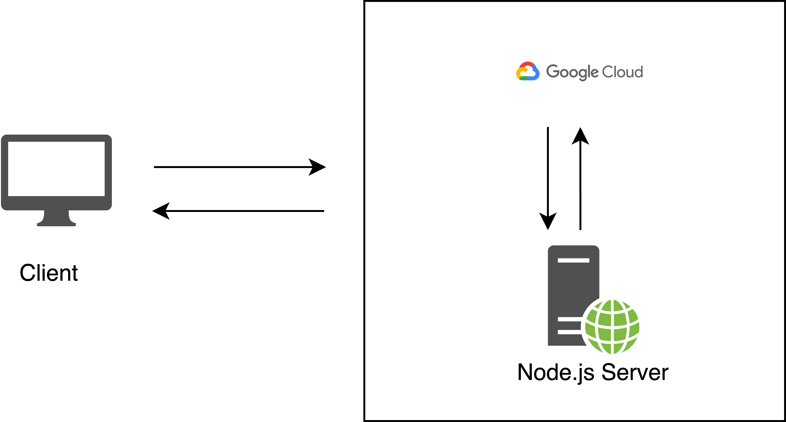

# Time Server Node.js App Deployment on GCP

### Author
Faniel S. Abraham

## Project Description
This project involves deploying a Node.js application to function as a time server on Google Cloud Platform (GCP). The server provides the current date and time in JSON format upon request.

## [Kindly refer to this google slide for more project description and screenshots.](https://docs.google.com/presentation/d/1DZpzzYBBD16ClJQkfH7Yfuhs2kTPg3iRdOf_gEPDFDw/edit?usp=sharing)

## Key Features
- **Efficient Handling**: Utilizes Node.js for server-side logic.
- **Accessible Time Server**: Clients can retrieve the current date and time in a structured JSON format.
- **Demonstrates Practical Application**: Showcases a simple yet functional server application using modern web technologies.

## Project Architecture

## Deployment Steps
1. **Set Up a Virtual Machine on GCP**
2. **Launch VM using SSH**
3. **Install Node.js and npm**: Instructions provided in slides.
4. **Create and Edit Node.js Server Code**: Guidelines on writing and editing code.
5. **Run the Node.js File**: Using command `sudo node [file_name] [port_number]`.
6. **Test Your Server**: Access the time server endpoint from your web browser:.

## Future Work
- Implement additional features like timezone conversion or localization.
- Enhance security with HTTPS and authentication mechanisms.
- Explore integration with other GCP services for advanced functionality.

## Conclusion
The deployment of the Node.js time server on GCP was successful, demonstrating reliability and scalability in timekeeping services.

## License

This project is licensed under the [MIT License](./LICENSE).
